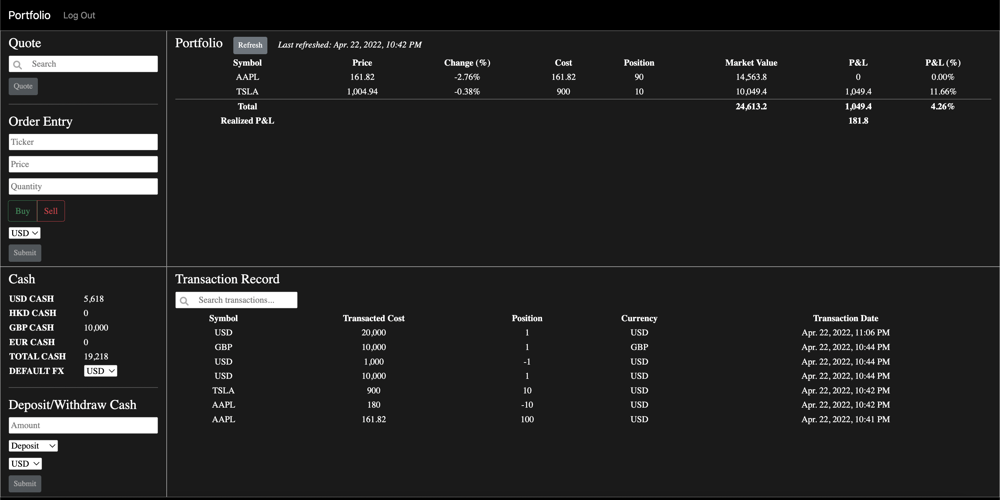

# Portfolio Tracker

An investment portfolio dashboard that enables users to conveniently manage their investments. Users can quote stock price, enter orders to trade, track their investment holdings, trades and transactions record, monitor cash balance as they deposit/withdraw cash and invest. 

# YouTube Demo

# Technology

#### Language: Python and JavaScript
#### Framework: Django, Selenium
#### Library: Bootstrap
#### Database: Postgres
#### Web Host: Railway
#### Market Data API Providers: Finnhub (Stocks) and Exchangerate.host (Exchange Rates)

# Features

## **Stock Quote**
Fetch real time stock price by entering stock symbol. Stock quote details can be transposed to order entry table as needed.
Note that due to limitation in API, only US stocks are supported at the moment. 

## **Order Entry**
User can enter stock symbol, price, quantity, transaction type and currency of the order. As this is a portfolio tracker, user can enter an order that was executed at a price different from the market price. Only USD is supported at the moment. 

Every order entry submission triggers multiple changes on the interface:
* Portfolio interface will be updated depending on different scenarios:
    * If the user has not owned the stock, the stock will be added to the portfolio, with all columns of data populated. 
    * If the user already owns the stock, multiple columns of the stock in the portfolio will be updated according to different circumstances:
        * Adding to existing position in the same direction
            * Price and Change updated to latest market price and change.
            * Cost updated to the new average price
            * Position updated to incorporate the change in quantity
            * Market Value, P&L and P&L% updated to latest record in the portfolio
        * Reducing existing position but user still owns the stock
            * Price and Change updated to latest market price and change.
            * Cost remain unchanged
            * Position updated to incorporate the change in quantity
            * Market Value, P&L and P&L% updated to latest record in the portfolio
        * Exiting all position 
            * Stock removed from portfolio 
        * Exiting all position and enter a new position with an opposite direction
            * Price and Change updated to latest market price and change.
            * Cost updated to price submitted in order entry
            * Position updated to quantity submitted in order entry plus original position (Example: existing position = 5; quantity submitted = -7; new position = 5 + (-7) = -2)
            * Market Value, P&L and P&L% updated to latest record in the portfolio
* Transaction Record will be updated with the submitted latest order added to the top of the Transaction Record table.
* Cash Record will be updated with a 'Buy' order reducing the USD and Total Cash balance, and a 'Sell' order increasing the USD and Total Cash balance. 

## **Portfolio**
The portfolio table shows the list of stock position that the user owns, including details such as stock symbol, stock price, change, cost, position, market value, P&L, P&L%. It also shows the total market value, total P&L, total P&L% and realized P&L at the bottom. 

## **Portfolio Refresh**
User can refresh the data in the Portfolio table. Live data such as market price and change will be fetched via the API connected to the market. Other columns such as market value, P&L and the totals will be updated accordingly. 

## **Transaction Record**
As the user enters order, deposits or withdraws cash, transaction record will be updated with the latest transaction added to the top, showing details such as symbol, transacted cost, position, currency and transaction date. 

## **Transaction Sorting**
User can click on the column names in the transaction table to sort transactions in ascending or descending order. 

## **Transaction Searching**
Enter any keyword of the transaction (i.e. symbol/transacted cost/position/currency/transaction date) in mind, and the user will get the filtered set of data.

## **Cash**
Cash table shows the cash balance of the user in multiple currencies. Only USD, HKD, GBP and EUR are supported currently. The total cash is based on the default currency the user chooses. Every time the user changes the default FX, the total cash will show the total cash balance in the currency the user chooses as default. It will be saved in the system until the user changes it again. 

## **Deposit/Withdraw Cash**
User can deposit/withdraw cash with the amount and currency of their choice. Cash table and transaction record will be updated accordingly. 

## **Mobile Responsiveness**
The page is mobile responsive. The screen will adjust according to the user's window size. 

## **Validations**
Entries in Quote, Order Entry and Deposit/Withdraw Cash will need to pass client side and server side validations in order to update the record permanently. 

# Instruction for First-Time User
1. Click on the link shown in the Link section.
2. Register for a new account.
3. Start managing your investment portfolio!